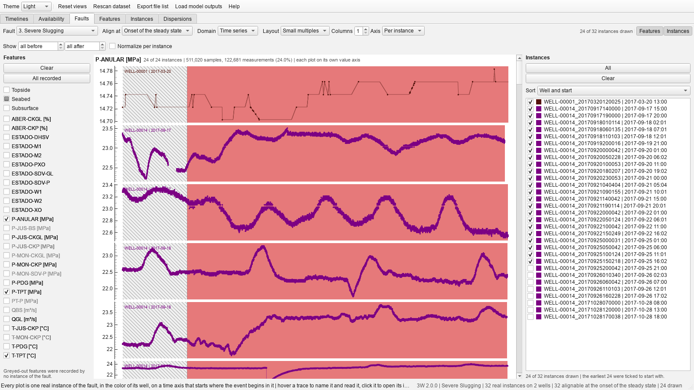

# Faults page
Every real instance of one fault, from every well, side by side. Rabelo's figures
2.5 and 2.6 put two instances of the same fault next to each other to make a point: the same event,
on two wells, has a different magnitude, a different time to install itself and a different
baseline. This page makes that comparison for any fault and every well at once, on a time axis that
starts where the event begins in each instance, so that the shapes line up whatever the clock said.

- **Layout** chooses between the two ways of showing them. *Small multiples*, the default, give
  every instance a plot of its own in a grid under a heading per feature (which gives the samples
  the section draws in the window of hours chosen, and how many were measured), each with its own value
  axis and its **label periods shaded behind the trace**, hatched where nobody labeled it, so that
  two dozen shapes can be read one against the next and the grid says how long each instance
  stayed in normal operation, in the transient and in the steady state, and how much of it the
  experts left unlabeled. *Overlaid* draws them all on one set of axes, which says how far apart
  the levels are and little else once there are more than a handful, which is why the grid is the
  default.
- **Columns** sets the width of the grid, one plot per row to start with, and **Axis** puts every small plot on its own value axis
  or all of them on one. The grid opens on the stretch of time most of the instances cover, so
  that one instance recorded for days does not leave every other plot a sliver against its left
  edge; Ctrl with the wheel zooms out to the rest.
- **Fault** picks the class; **Align at** picks the moment the axis of every instance starts from,
  the onset of the transient, the onset of the steady state, or the start of the recording. An
  instance whose labels never reach the moment chosen cannot be aligned on it and is greyed out in
  the list on the right; the moments come from the label runs the catalogue keeps, so the list
  costs nothing, and only the instances ticked are read from disk.
- **Normalize per instance** scales every series to its own level, each reading as standard
  deviations from the mean of that sensor over the whole instance, which is how Rabelo's pipeline
  normalizes: wells run at different levels, and the shape of the change is what the instances
  share. Readings outside the plausible range are left out before scaling, as the pipelines mask
  them before they normalize. **Show … h before / after** narrows the plots to the hours around the
  onset; at zero, everything recorded is drawn.
- **Hover** a line to bring it forward and name it; the status bar gives the instance, its onset,
  the time under the pointer relative to it, the label and the well status at that moment, and the
  readings of the selected features. Pointing at an instance in the list does the same.
- **Click** a plot to open the instance window of its instance on that feature: a small plot opens
  the one instance it holds, an overlaid plot the line the hover has named (a pooled *Overall*
  curve stands for many instances and opens none). Clicking an instance's **name** in the list
  opens its window too, on its default features; a click on its check box ticks it, as
  before.
- Beyond two dozen instances the earliest are ticked to start with, and the grid draws at most
  four dozen of them; **All** and **Clear** and the checkboxes choose. Readings outside the
  plausible range are left out of the value axis, so one broken gauge does not flatten every other
  line; the instance carrying them wears a ⚠ in the list.
- **Features** work as in the instance window: the page opens on the analog sensors of the
  seabed (P-ANULAR, P-TPT, T-TPT) for every fault, and **Topside**, **Seabed** and **Subsurface**
  tick or clear every recorded sensor of one placement. Features no instance of the fault recorded
  are greyed out.