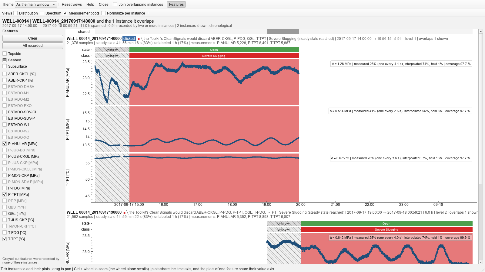
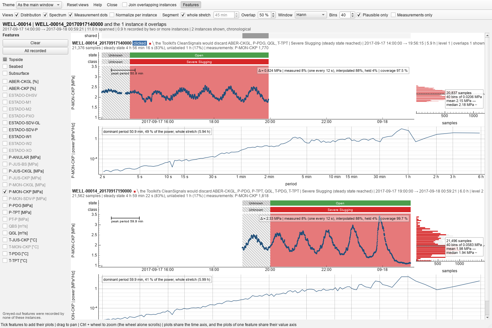
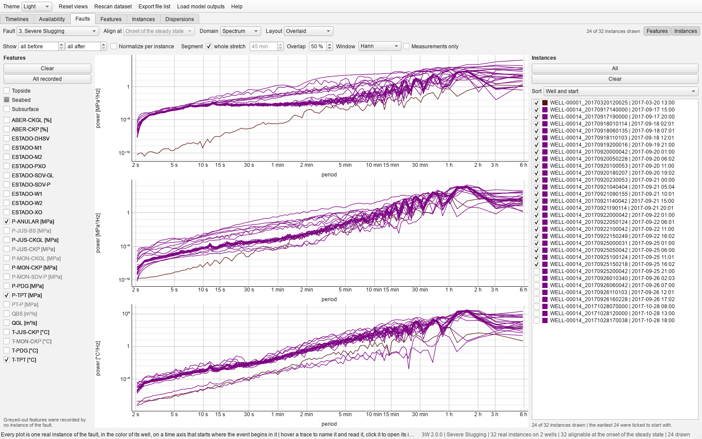

# Instance window 
One block per bar of the timelines, stacked chronologically on a shared time
axis, so the overlapping stretches line up vertically. Each block has a header, the well
operational status (`state`) and the label (`class`) as thin bands, then one plot per selected
feature. The header's first line names the block (its event, flags, span and stack level); the
second says what it holds: its samples, the time it spends in normal operation, in the transient,
in the steady state and unlabeled (each with its share of the block; a merged block counts the
stretches its instances fill in for one another once), and, for every ticked feature, how many of
its samples the PI historian actually archived (the share and the interval stand beside each
trace). A band at the top marks the stretches recorded by two or more of the bars shown.

- A **joined bar opens as one block**: its instances are read as the single continuous recording
  they were cut from, drawn as one series over one set of bands, with a dashed line where each
  further instance begins. Every instant appears once, and what one window says nothing about the
  others fill in: a sensor it did not record, or a sample its experts left unlabeled. The `class`
  band of a merged recording therefore carries far less *Unknown* than its instances did apart: on
  the largest join of 3W 2.0.0, seventy-one windows over six days, 1.6 % of the samples against a
  third of the samples the windows carried separately. That matters because unlabeled samples are
  dropped, so the merged recording is what a model would actually be trained on. Each stretch keeps
  the color of the file that labeled it, so a normal period labeled by a *Normal Operation* file
  stays green inside a recording that goes on to develop a fault. Stacked slices also become
  unreadably thin long before seventy of them; one block does not.
- **Join overlapping instances** is also a checkbox in this window's own toolbar, and **the group a
  window opens on is all it is ever about**: the box merges exactly the instances on screen, so it
  answers what this group alone amounts to rather than what the whole well does. Two of them that
  overlap only through an instance outside the window therefore stay apart, and nothing is ever
  brought in. It changes this window and nothing else, neither the grid nor any other instance
  window, and turning it off lands exactly where it started, feature selection included. A window
  opened from a bar the timelines had already merged is showing that merge and has nothing of its
  own left to do, so its box is ticked and disabled (as it is in a window opened on a stitched
  well, see [Timelines.md](Timelines.md): its recordings laid end to end, the axis jumping at each
  solid line, the dashed seams of its hundreds of instances left out so the stitches show); a group with nothing to merge disables it too,
  and says which case it is.
- **Features** are chosen with the checkboxes on the left (features none of the instances recorded
  are greyed out). A window opens on the analog sensors of the **seabed** (P-ANULAR, P-TPT, T-TPT),
  the same for every event; only when none of them was recorded does it fall back to the first
  recorded feature in alphabetical order. Opened from the availability page, the sensor clicked is
  drawn instead, opened from a plot of the Faults or Features page, the feature of that plot, and
  opened from a dot of the Dispersions page, the two sensors of its plot, X and Y.
- **Topside**, **Seabed** and **Subsurface** tick, in one click, every recorded sensor measured at
  one placement of the production system: on the platform above water (the production choke and
  shutdown valve, the gas-lift and service lines), at the christmas tree on the seabed, and in the
  well below it (the downhole gauge and safety valve). A second click clears the placement; the
  boxes add up, and a box shows half ticked while only some of its sensors are selected. They
  replace a *Signature* box that ticked a per-fault set of variables: those sets are not agreed on
  and steered the reading toward them, so which part of the system matters is now the user's
  choice. The variables the papers draw each event in are still listed in the help's Fault classes
  tab. The placements are `config.PLACEMENTS`, from table 2 and figure 1 of the 2.0.0 article.
- All plots **share the time axis**, and the plots of one feature **share their value axis** across
  instances, so the same reading is at the same height everywhere.
- **Theme**, in the toolbar, paints this window alone light or dark, whatever the main window is
  in, and *As the main window* follows it again. A window with a theme of its own ignores the main
  window's switches; the others follow them, keeping their zoom.
- **Normalize per instance**, in the Views row, draws every trace as z-scores over its own block
  (readings outside the plausible range left out first), as the Faults and Features pages do.
  Blocks recorded at different levels then share one value axis per feature, and the shape of the
  change is what is compared. The histograms, the spectra and the readout under the crosshair
  read the same scaled readings; the figures beside each trace stay in the sensor's unit.
- A **crosshair** follows the pointer through every plot; the status bar gives the time under it and,
  per instance, the label, the operational status and the selected readings at that time.
- Each plot reports the total variation of the signal (Δ = max − min, marked *flat* for a frozen
  sensor), the share of samples carrying a reading, and how the sensor was measured: the share of
  its readings that are measurements and the interval between them. A sensor never moving is held
  on a padded axis instead of being autoscaled into noise.
- Every trace draws its **measurements as dots**, with the line through every sample faint
  beneath them; between two dots that line is exactly the straight line the historian drew, so
  dense dots are a sensor read every second and sparse dots on a faint line a sensor read every
  two minutes and filled in between. A valve state is not tested and keeps its plain line, and so
  does a sensor measured at every sample. The Faults and Features pages draw their traces the
  same way, in the color of the series. **Measurement dots**, in the Views row, turns the marks
  off for the plain line throughout, which is what the file holds and what a pipeline reads; the
  figures beside each plot go on saying how much of it was measured.
- A **reading outside the plausible range** is drawn in amber over the trace, sample by sample, so
  the stretch that is garbage is seen for what it is; the panel's figures call it out, the header
  of the block names the sensors, and the feature's checkbox wears a ⚠.
- Two **pressures out of order** along one line (downstream above upstream by more than 1 MPa, in
  more than 1 % of the samples compared) are warned of the same way: the header of the block names
  the pair and how often, the contradicting samples are drawn dashed in amber on both plots, whose
  figures give the share and the largest gap, and both checkboxes wear a ⚠. The pairs are the
  production line from the downhole gauge to the platform (P-PDG, P-TPT, P-MON-CKP, P-JUS-CKP) and,
  on the service line, P-MON-CKGL and P-ANULAR each above P-JUS-CKGL; a pair across a choke is
  compared only while the choke is open, the annulus only while its valves are. The rules and the
  survey behind them are in [`backend/config.py`](../../src/overlap_viewer/backend/config.py) and
  the help's Data availability tab. The Availability and Timelines pages mark the same instances
  in the bottom-right corner of their cells and bars.
- **Statistics**, in the toolbar (Ctrl+T), opens a table of what the readings of every sensor
  ticked amount to, one row per sensor of every block: the count, the mean, the median, the
  standard deviation, the extremes, the quartiles, the skewness and the excess kurtosis, in the
  unit the traces are drawn in (never the z-scores of *Normalize per instance*, whose mean and
  spread are zero and one by construction). The table follows the window: a sensor ticked or
  cleared, or the instances joined, and it is counted again. **Stretch on screen only** describes
  the stretch of time the plots show rather than every block whole, so that zooming or panning
  chooses the window described, the table following every pan and zoom, and a block wholly off
  screen dropping out. **Measurements only** describes the samples the historian archived alone,
  the ones it held or interpolated between them left out: the mean barely moves, the spread and
  the tails can. A sensor reading outside its plausible range wears a ⚠, its figures counting the
  garbage as it is. **Copy** puts the table on the clipboard, tab separated, for a spreadsheet.

**Signal views**: two more views of every feature plot of the instance window, each placed
where it shares an axis with the trace, and a *Domain* box on the Faults and Features pages that
draws every instance in one of them. The events are slow: severe slugging on WELL-00014 cycles every
50 to 90 minutes, flow instability on WELL-00001 every 45, so a six-hour instance holds four to
seven cycles, and the spectral axis is a **period**, logarithmic, not a frequency that would read
0.0002 Hz.

- **Distribution** is a marginal histogram to the right of the trace, turned on its side so its
  value axis is the trace's; the bars are stacked by label period in the class colors, so how the
  event moves the readings is read inside one instance, and a solid line marks the mean, a dashed
  one the median. A bimodal shape is an oscillation.
- **Spectrum** is Welch's estimate of the power spectral density against period, both logarithmic,
  the mean and the linear trend removed first and the missing samples interpolated, readings
  outside the plausible range left out. It takes a row under the trace, the period along the
  bottom. Its caption gives the **dominant period and its share of the power**: a few percent for a
  normal instance, half or more for an oscillating one; and one cycle of that period is laid as a
  bar against the trace, so the claim can be checked against the waves.
- Both are counted over the **stretch of time on screen**, so zooming is brushing. A merged
  recording is transformed as the single series it is, never stitched from its parts.

There was a third view, a **spectrogram** under each trace on the shared time axis. It was dropped:
it earned its place only over a merged recording of days, where the slugging period drifts, and
everywhere else it said what the spectrum already said while taking a row of its own from every
feature of every block, which is the scarce thing in a window that stacks them.
- **Plausible only**, beside *Bins*, is what every histogram counts by default: the readings inside
  the plausible range. That is what a histogram is normally asked for
  (one gauge reporting 10¹² Pa would otherwise put every genuine reading into the first bin), but it
  hides the very thing a data review is looking for, so unticking it counts the garbage too, on an
  amber ground beyond the range, with the caption saying how many were *counted* rather than how
  many were left out. The one tick serves the marginal of an instance window, the *Distribution*
  domain of the faults page and the features page. Spectra are not affected: interpolating over a
  spike of 10¹² gives the spectrum of the spike, not of the signal, so they always mask it.
- **Measurements only**, beside it, counts and transforms the measurements alone, leaving out the
  samples the historian filled in between them. A histogram then counts what was read, and says
  so in its caption; a spectrum becomes the **Lomb-Scargle periodogram** of the readings at their
  own instants, which fits a sinusoid of each period to them by least squares and needs no grid:
  the honest spectrum of a series read every ten seconds or every two minutes, where a transform
  of the 1 Hz grid is a transform of the historian's lines. Its caption gives the share of the
  variance a sinusoid of the peak period explains and how many measurements it was taken over;
  the periods run from twice the typical interval between measurements up to the stretch; and it
  is scaled so that it integrates to the variance of the measurements, as a density does, so it
  sits on the axis Welch's estimate would and pools with it band by band under *Overall*. The one
  tick serves the instance window, the Faults page and the Features page.
- **Segment**, **Overlap**, **Window** and **Bins** are the parameters, the same widgets in both
  windows, on a toolbar row of their own so that a narrow window never hides them. Nothing longer
  than a segment can be resolved, so the plots grey the periods beyond it; with *whole stretch*
  ticked the spectrum is the periodogram of everything on screen, the only way to see a slugging
  line, since a segment of a few minutes holds no cycle of it.
- On the **Faults page**, *Overlaid* spectra read together where overlaid traces did not, the
  question being whether their peaks line up; **Overall** pools instead of overlaying: on the
  Faults page into one curve per feature across every well, on the Features page into one curve
  per fault class, which is the feature-level histogram this was built for. A distribution pools
  by putting the readings together; a spectrum never pools by concatenation, since a transform
  reads consecutive samples as one second apart and the months between two instances would become
  a step, so the estimates are averaged band by band on a shared period axis, as Welch's method
  already does one level down. **Join overlapping**, beside it, first reads the windows of a well
  that overlap as the single recording they were cut from, so the samples two windows share are
  counted once instead of twice; counting them twice inflates a pooled histogram at exactly the
  levels that well was recorded twice at. Overall is offered off the time axis only: instances
  cut from different months have no common clock. Histograms are drawn as a share of each
  instance's
  samples (stacked bars in the grid, a filled area in the series color when overlaid, so that
  where two distributions sit on top of one another reads as a deeper shade), with the mean and
  the median of each as lines in the grid and a **triangle over the fullest bin** of each in
  either layout: the value that instance spends most of its time at,
  which the mean and the median both miss once a fault has skewed the readings or split them in
  two, and which hovering the curve reads out. *Normalize per instance*
  puts different wells on one z-score axis. The hours before and after the onset pick the stretch
  transformed, so "2 h after" gives the spectrum of the fault alone, which is the only way *Align
  at* reaches these two domains, nothing being drawn against the hours from the onset, so with both
  hour boxes at *all* the box is greyed and comes back as soon as hours are asked for. **Features**
  and
  **Instances**, at the right end of the toolbar, hide the feature panel and the instance list to
  give the plots their width; the instance window has the same **Features** toggle beside *Join
  overlapping instances*.

There is deliberately no phase spectrum of a single signal (its phase depends on where the file
begins and tells nothing the trace does not) and no wavelet transform; the cross-spectrum phase
between two sensors, and any other view of how a period moves along a recording, are left for a
later version.

The pages are interactive counterparts of static figures once produced by hand for each well and
each fault before anything was computed on the instances: the timelines of `faults_per_well.pdf`
and `fault_<n>_real_instances.pdf`, the availability page of the cleaning rules applied first, the
faults page of the per-fault figures.