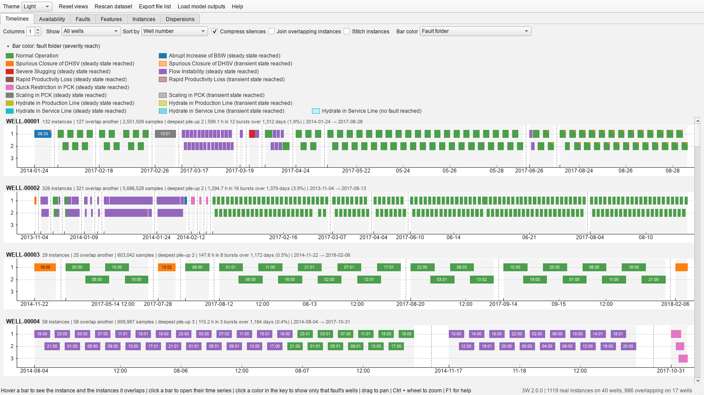

# Timelines page
A grid of plots, one per well. Every real instance recorded on the well is a
bar from its first to its last timestamp; instances that overlap in time are stacked on top of each
other (the row is the *stack level*), so a well recorded twice shows at a glance. The months of
silence between bursts of recording are collapsed to narrow dashed blanks, and the time scale is
uniform everywhere else: a bar's length is a duration and two bars overlap on screen exactly when
the instances overlap in time. Untick *Compress silences* for a true calendar axis.

The line above each plot sums the well up: its instances (or, joined, its bars), its samples, its
deepest pile-up, the hours recorded and the span. A sample two overlapping instances share is
counted in each, and once when *Join overlapping instances* is ticked. Under a *Bar color* that
names a sensor it adds that sensor's measurements on the well, out of its readings, once the
profiles have been read (the *Measurements* coloring reads them; a header never starts the pass).

- **Hover** a bar: it gets a heavy outline, every instance of the well that overlaps it gets a
  lighter one, the stretch they share is hatched, every other bar fades, and the status bar names
  the instance, its fault, how far the fault got, its time span, size, stack level and partners,
  and the sensors, if any, that read outside their plausible range in it. The colors those
  instances carry light up in the key above the grid, and the rest dim, so the color under the
  pointer can be named without leaving the plot. Resting the pointer on the bar brings up a tooltip
  with its start and end stamps and its duration (a joined bar spans from its first instance's
  start to its last's end).
- **Click** a bar: an instance window opens with the time series of that instance and of every
  instance it overlaps.
- **Click a color in the key**: the grid shows only the wells that recorded that fault. Clicking it
  again, or the button that appears at the right of the page's toolbar, brings every well back.
- **Join overlapping instances** (toolbar checkbox) merges the instances of a well that overlap in
  time into one bar wherever their labels agree on the shared stretch; an unlabeled sample agrees
  with anything. Instances whose labels disagree there stay apart, so what still overlaps after the
  join is exactly the labeling conflicts, and *Wells with overlaps* then lists the wells that have
  one. A bar joined from several fault folders is striped with every folder's color and says how
  many more instances it joins after its timestamp (`+2`); clicking it opens its instances as the
  single continuous recording they were cut from.
- **Stitch instances** (beside it) shows how the levels of a well changed from one recording to
  the next, months apart: the joined bars of every well are laid end to end, the silences between
  them left out, so each well becomes one bar holding its whole history, a solid line marking each
  stitch. Clicking it opens every reading of the well as one recording in the instance window, on
  an axis that keeps the real timestamps (the hover reads the true time) and jumps at each solid
  line. Stitching joins first, so it ticks *Join overlapping instances* and holds it ticked;
  unticking the stitch leaves the join as it was before. *Compress silences* rests meanwhile.
  - A stitched bar's figures are its recordings': its samples and hours are those recorded, not the
    calendar span, which its tooltip gives besides.
  - Joined bars that still overlap (a labeling conflict) sit on a lane of their own, and each lane
    stitches into a bar of its own rather than having two disagreeing labels merged. On 3W 2.0.0
    no well has one, so every well stitches into a single bar.
  - The *Descriptor* and *CleanSignals* colorings judge one recording at a time and leave a
    stitched bar empty, saying so on hover; the Instances map colorings do the same.
  - The largest well, WELL-00002 (326 instances in 20 recordings, 4.6 million samples), takes about
    ten seconds to open and some 1.8 GB while it is open; its instances are read past the cache of
    loaded instances, so the other windows keep theirs.
- **Bar color: Availability of a sensor** tints every bar by the share of its samples in which the
  chosen sensor is live, faint for a few and full for all, grey for a sensor that never moved,
  empty for one never recorded, so the grid becomes the history of that sensor on every well: an
  era of absence, or a scattering of it. A key of its own takes the place of the fault key while it
  is on; the outline of a bar keeps its fault hue.
- **Bar color: Measurements of a sensor** tints every bar by the share of the sensor's *live*
  samples that were actually measured rather than filled in by the plant's historian (see
  the note on sampling in the root README.md), so an era in which a sensor was archived
  every two minutes reads apart from one in which it was read every second. Hover a bar for the
  share and the interval. The first time, it reads every instance in full behind a progress dialog
  and keeps the result in the cache.
- **Bar color: Descriptor of a sensor** tints every bar by one figure of the sensor's series (the
  time its autocorrelation takes to halve, its signal-to-noise ratio, the slope of Zhang's
  Gaussianity regression, its skewness or its kurtosis), ranked among the bars on show, faint for
  the smallest and full for the largest, so the grid shows which recordings of a sensor were slow,
  noisy, heavy-tailed or skewed. The *on* box takes the figure on the 1 Hz grid or on the
  measurements alone; on the grid the key and the hover carry the caveat that the historian's lines
  inflate the first two. Hover a bar for both values and the rank.
- A small **amber triangle** in the corner of a bar marks an instance in which a sensor reads
  outside its plausible range; tinted by one sensor, the mark is for that sensor alone.
- The same triangle in the **bottom-right corner** marks pressures read out of order along their
  line, the status bar naming the pairs, once the profile pass has run (see
  [Availability.md](Availability.md)).
- **Retract the key** by clicking its title (or `Ctrl+L`) to give the grid the room. Retracted it
  still answers hovering: the entries of the instance under the pointer, and of the instances it
  overlaps, pop into the title row.
- **Drag** to pan, **Ctrl + wheel** to zoom (the plain wheel scrolls the grid), **right-click** for
  pyqtgraph's menu (view all, export).
- The page's toolbar sets the number of columns, filters the grid to the wells that have overlaps,
  and sorts wells by number, overlapping instances, instances or deepest pile-up. The right end of
  the status bar counts the instances, wells and overlaps on show.