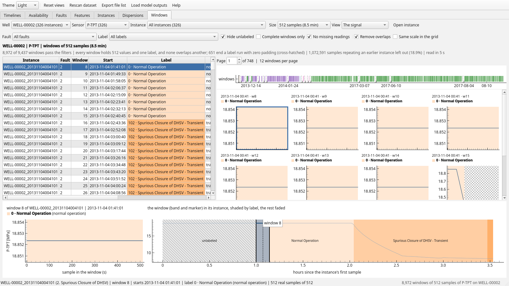
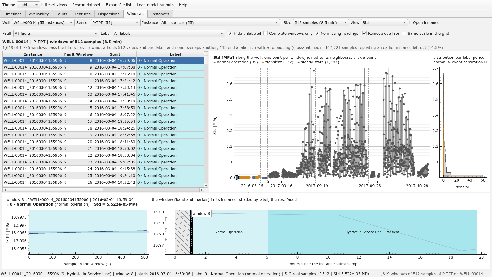

# Windows page
One sensor of a well the way a model of the 3W reads it: cut into windows of a fixed number of
samples, every window carrying one label. The division is made here, in software, from the
instance files themselves: choose a well and a sensor and every instance of the well is read,
behind a progress dialog, and cut into windows of 256, 512 or 1024 samples
([`algorithms/windows.py`](../../src/overlap_viewer/algorithms/windows.py),
[`frontend/windows_page.py`](../../src/overlap_viewer/frontend/windows_page.py)).

The division follows four rules, those of the `3w_estudo` study's division, which writes the
windows to disk and audits them:

1. **Exact size.** Every window holds exactly the number of values chosen.
2. **One label.** An instance is split into runs of constant label (normal operation, every
   fault's steady state, every transient and the unlabeled stretches are distinct labels), and
   every run is cut into consecutive windows of its own. No window passes from normal operation to
   a transient or a fault, so the label of a window is the label of every one of its samples.
3. **Zero padding.** When the end of a run does not fill a window, the last window of the run is
   completed with zeros at its end, cross-hatched on every plot. Its real samples are counted, and
   its statistics are taken over them alone.
4. **Each instant once.** The instances of the well are walked in chronological order and each
   loses the samples an earlier one already covered, so no instant is in two windows. On 3W the
   first, unlabeled hour of an instance is usually a copy, sample by sample, of the last hour of
   the one before: 18.9 % of the samples of WELL-00002's P-TPT. Untick **Each instant once** to cut
   every instance whole.

Nothing is written to disk. The largest well of 3W 2.0.0, WELL-00002, holds 5.7 million samples of
one sensor over 326 instances; they are read (two columns of every file) and cut in about two
seconds, and kept for the session.

- **Well**, **Sensor** and **Instance** choose what is cut: the page opens on the well with the
  most instances and on the first of the sensors the `3w_estudo` sensor study found clearest
  (P-TPT, T-TPT, P-MON-CKP, …) that is live in the well; the count beside a sensor is how many of the
  well's instances recorded it. **Instance** keeps the windows of one instance alone, and frames
  the strip on it. **Size** is the number of samples per window.
- **Fault** keeps the windows of the instances of one fault folder, **Label** those of one label.
  **Hide unlabeled**, **Complete windows only** (no padding) and **No missing readings** thin them
  further. The caption counts the windows that pass, the padded ones and the samples left out as
  repetitions.
- **Every window is written with its label**: the code the `class` column carries and its name
  (*0 · Normal Operation*, *102 · Spurious Closure of DHSV - Transient*, *2 · Spurious Closure of
  DHSV*, *— · unlabeled*), in the table, above every thumbnail and above the window selected. The
  colors are those of the instance window's class band ([the color code](ColorCode.md)): a fault's
  steady state in its hue at full strength, its transient lighter, a normal stretch in the faint
  hue of its instance's folder, an unlabeled one grey and hatched.
- The **table** lists the windows that pass: the instance, its fault folder, the window's number in
  its instance, its start, its label (in the label's color), its period, its real samples, its
  padding and its share of missing readings. The **strip** above the grid places them along the
  well's gap-compressed time axis, each in its label's color and a tone apart from its neighbour;
  hover it for a window, click it to select one. The **grid** shows twelve thumbnails a page, with
  **Same scale in the grid** for one vertical scale over the page.
- **Click** a row, a thumbnail, a window of the strip or a point of a feature to draw the window
  large at the bottom, beside the instance it was cut from: the window outlined, the instance shaded
  by label, the repeated head hatched. **Double-click** a row, or **Open instance**, to open the
  instance in an [instance window](InstanceWindow.md) on this sensor.

**View** swaps the thumbnails for one statistic of every window, among the ones the viewer already
computes (`algorithms/descriptors.py`): those of the instance window's [statistics
table](InstanceWindow.md) (mean, median, standard deviation, minimum, first and third quartiles,
maximum, skewness, excess kurtosis) and those the [Timelines](Timelines.md) color a bar by
(autocorrelation time, signal-to-noise ratio, Gaussianity slope).

- Every window is handed to the same `describe` the statistics table uses: its padding left out,
  its missing readings dropped, its readings in the unit the traces are drawn in. A window of fewer
  than eight readings, or one that never moves, has its mean, spread and quantiles and nothing
  else. The first statistic asked of a cut (a well, a sensor, a size) describes every window at
  once, behind a progress dialog, in one to three seconds on WELL-00002, and every other statistic
  is then instant; the cuts are kept for the session. On the 1 Hz grid the historian's straight
  lines between measurements inflate the autocorrelation time and the signal-to-noise ratio, as
  everywhere in the viewer.
- The statistic is drawn one point per window along the well, colored by label period (normal
  operation, transient, steady state, unlabeled) and joined to its neighbours, beside its
  distribution per period and the **separation** of normal windows from event windows,
  |AUC − 0.5| · 2, from 0 (indistinguishable) to 1 (split): over WELL-00014's P-TPT, the standard
  deviation of a 512-sample window separates them at 0.95.
- The table gains the statistic's column, written as the statistics table writes it, and the
  window selected draws it over the signal: a line for a level (mean, median, extremes, quartiles),
  a band of one standard deviation around the mean for the spread.
